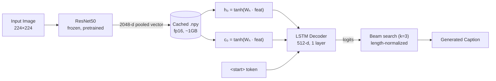

<div align="center">
  <h1>Image Captioning</h1>
  <p>PyTorch · ResNet50 · LSTM · COCO 2017</p>

  <p>
    <a href="https://github.com/MohamedShakshak/Image-Captioning/actions">
      
    </a>
    
    
    <a href="https://huggingface.co/spaces/MohamedShakshak/image-captioning-pytorch">
      
    </a>
    <a href="https://huggingface.co/MohamedShakshak/image-captioning-pytorch">
      
    </a>
  </p>

  <p>
    <strong><a href="https://huggingface.co/spaces/MohamedShakshak/image-captioning-pytorch">Try the live demo</a></strong>
    ·
    <a href="#results">Results</a>
    ·
    <a href="#reproduction">Reproduction</a>
    ·
    <a href="#project-structure">Structure</a>
    ·
    <a href="#design">Design</a>
  </p>
</div>

---

Automatic image captioning model built from scratch with PyTorch. Given an input image, it generates a natural-language description using a frozen **ResNet50 encoder** and a trained **LSTM decoder** with beam search. Trained on [COCO 2017](https://cocodataset.org) and deployed as an interactive Streamlit demo on HuggingFace Spaces.

## Demo

Upload an image and the model returns a caption alongside the top-k beam search hypotheses with cumulative log-probabilities.

<p align="center">
  
</p>

**[Launch the demo →](https://huggingface.co/spaces/MohamedShakshak/image-captioning-pytorch)**

## Architecture



The image is encoded once by a frozen ResNet50 (no backprop) and the resulting 2048-d vector is used to initialise the LSTM's hidden and cell states. The decoder then generates one token at a time, conditioned on both the image context and the previously generated words, until it emits an `<end>` token. Beam search with k=3 and length normalisation (`α = 0.7`) selects the best candidate.

## Results

Evaluated on the COCO 2017 validation set (5,000 images, 5 references each) using the standard `pycocoevalcap` toolkit.

| Metric  | Score  | Notes |
|---------|--------|-------|
| BLEU-1  | 0.592  | Unigram precision |
| BLEU-2  | 0.408  | Bigram precision |
| BLEU-3  | 0.284  | 3-gram precision |
| **BLEU-4**  | **0.203** | Standard captioning metric |
| **CIDEr**   | **0.604** | TF-IDF weighted consensus |
| ROUGE-L | 0.405  | Longest common subsequence |
| METEOR  | _TBD_  | Synonym-aware matching (Java req.) |

## Reproduction

Full training can be reproduced on Kaggle in two steps.

### Prerequisites

- **Kaggle account** with GPU accelerator enabled (P100 or T4)
- **HuggingFace account** with a write-access [token](https://huggingface.co/settings/tokens)

### Step 1 — Cache encoder features (one time, ~1 h)

[`notebooks/cache_features_kaggle.ipynb`](notebooks/cache_features_kaggle.ipynb) runs the frozen ResNet50 over every COCO 2017 image and saves the pooled 2048-d vectors as fp16 `.npy` files (~1 GB total). This decouples the encoder pass from training, reducing per-epoch time from ~3 h to ~20 min.

1. Open the notebook on Kaggle.
2. Add the dataset `awsaf49/coco-2017-dataset`.
3. Run all cells.
4. Upload `/kaggle/working/features/` as a new Kaggle Dataset (e.g. `coco-features-2048`).

### Step 2 — Train the decoder

[`notebooks/train_kaggle.ipynb`](notebooks/train_kaggle.ipynb) runs the full training pipeline.

1. Open the notebook on Kaggle.
2. Add datasets: `awsaf49/coco-2017-dataset` and your `coco-features-2048`.
3. Set your HuggingFace token as a Kaggle Secret (`HF_TOKEN`).
4. Run all cells. Training completes in ~6 h on a P100 (20 epochs).
5. The best checkpoint is automatically pushed to HuggingFace Hub.

Checkpoints are saved every epoch (`latest.pt` for resume, `best.pt` for deployment). If a session is interrupted (Kaggle 12-hour limit), restarting the notebook auto-resumes from the latest checkpoint.

### Local development

```bash
# Install PyTorch (CPU or CUDA — platform-specific)
pip install torch torchvision --index-url https://download.pytorch.org/whl/cpu

# Install the package and dev dependencies
pip install -e .[dev]

# Run unit tests (11 tests, CPU synthetic data, <5 s)
pytest -q

# Lint and type-check
ruff check src tests scripts
mypy src/
```

## Project structure

```
src/
├── config.py          # Config dataclass + YAML loader + argparse overrides
├── data/
│   ├── dataset.py     # COCO 2017 dataset with cached .npy features
│   ├── vocab.py       # Vocabulary builder (word2idx, tokenizer, special tokens)
│   └── transforms.py  # Image preprocessing (Resize → CenterCrop → Normalize)
├── models/
│   ├── encoder.py     # Frozen ResNet50 (torchvision, pretrained)
│   └── decoder.py     # LSTM with image-conditioned initial states
├── train.py           # Hand-rolled training loop with checkpoint resume
├── evaluate.py        # pycocoevalcap (BLEU, CIDEr, ROUGE-L, METEOR)
├── inference.py       # Greedy decoding + beam search with length normalisation
└── captioner.py       # Captioner.from_pretrained() — loads weights from HF Hub

scripts/
├── cache_features.py  # One-time encoder pass over all COCO 2017 images
├── build_vocab.py     # Builds vocab.json from COCO annotations
└── plot_curves.py     # Training curves from metrics.json

notebooks/
├── cache_features_kaggle.ipynb   # Kaggle notebook for Step 1
└── train_kaggle.ipynb            # Kaggle notebook for Step 2
```

## Design

<dl>
  <dt><strong>Cached encoder features</strong></dt>
  <dd>ResNet50 is frozen and run once over all training images. The resulting 2048-d fp16 vectors are cached to disk (~1 GB). This reduces per-epoch training time from ~3 h to ~20 min — a 9× improvement.</dd>

  <dt><strong>Image-conditioned decoder initialisation</strong></dt>
  <dd>The image vector is projected into the LSTM's hidden and cell states via two independent linear layers (<code>tanh</code> activation). This primes the decoder with visual context before it sees any text, allowing a 1-layer LSTM to produce coherent captions without an attention mechanism.</dd>

  <dt><strong>COCO 2017 annotations (no Karpathy split)</strong></dt>
  <dd>Training and validation use the official COCO 2017 annotation files directly, avoiding the COCO 2014→2017 path mismatches that complicate Karpathy-split-based pipelines.</dd>

  <dt><strong>Hand-rolled training loop</strong></dt>
  <dd>The training loop is written in vanilla PyTorch (~120 lines) without Lightning, HuggingFace Trainer, or other abstractions. This makes every component — forward pass, loss computation, gradient clipping, checkpoint serialisation — fully transparent.</dd>

  <dt><strong>torch is an optional dependency</strong></dt>
  <dd>PyTorch is listed as an optional extra because different platforms require different binaries (CPU, CUDA 11.8 for P100 compatibility, CUDA 12.x for modern GPUs). Kaggle pre-installs a compatible version; local users install via <code>pip install torch</code>.</dd>

  <dt><strong>Beam search with length normalisation</strong></dt>
  <dd>At inference, beam search (k=3) with length normalisation (<code>α = 0.7</code>) balances the cumulative log-probability against sequence length, preventing a bias toward overly short captions. <code>&lt;unk&gt;</code> and <code>&lt;pad&gt;</code> tokens are masked in the output.</dd>

  <dt><strong>Augmentation deferred to v2</strong></dt>
  <dd>The current caching strategy encodes each image once with a deterministic transform. Per-epoch data augmentation would require re-encoding every epoch, negating the speed benefit. This trade-off is documented and accepted for v1; augmentation can be added in a future iteration without changing the model architecture.</dd>
</dl>

## License

[MIT](LICENSE)

## References

- **Show, Attend and Tell** — Xu et al., NeurIPS 2015. [[arXiv]](https://arxiv.org/abs/1502.03044)
- **Show and Tell: A Neural Image Caption Generator** — Vinyals et al., CVPR 2015. [[arXiv]](https://arxiv.org/abs/1411.4555)
- **Microsoft COCO: Common Objects in Context** — Lin et al., ECCV 2014. [[arXiv]](https://arxiv.org/abs/1405.0312)