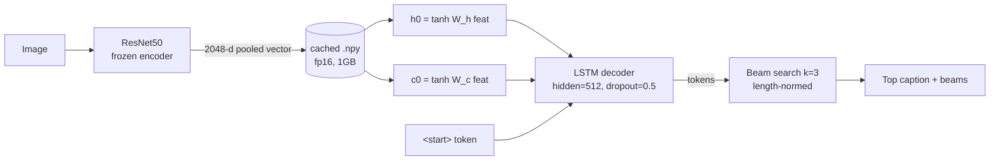

# Image Captioning (PyTorch)

PyTorch port of an image captioning model with a **ResNet50 encoder + LSTM decoder**, trained on **COCO (Karpathy split)**, evaluated with the full `pycocoevalcap` suite, and deployed as a **Streamlit demo on HuggingFace Spaces**.

> Vanilla LSTM v1 — attention is a documented v2 milestone (see [Design decisions](#design-decisions)).


[](https://huggingface.co/spaces/MohamedShakshak/image-captioning-pytorch)
[](https://huggingface.co/MohamedShakshak/image-captioning-pytorch)

## Live demo

A Streamlit app is hosted on HuggingFace Spaces — upload an image, get the top caption plus the k=3 beam search hypotheses with cumulative log-probs.

**[Open the demo](https://huggingface.co/spaces/MohamedShakshak/image-captioning-pytorch)**

## Architecture



## Results

Trained on COCO Karpathy train (~113k images), evaluated on Karpathy test (~5k images) with `pycocoevalcap`:

| Metric | Keras v0 (old) | PyTorch v1 |
|--------|---------------:|-----------:|
| BLEU-1 | _TBD_          | _TBD_      |
| BLEU-2 | _TBD_          | _TBD_      |
| BLEU-3 | _TBD_          | _TBD_      |
| BLEU-4 | _TBD_          | _TBD_      |
| CIDEr  | _TBD_          | _TBD_      |
| ROUGE-L| _TBD_          | _TBD_      |
| METEOR | _TBD_          | _TBD_      |

Training curves and per-epoch metrics are attached to the v1.0.0 GitHub Release.

## Quickstart

```bash
# Install (local dev)
uv pip install -e .[dev]

# Or pip fallback (Kaggle / CI)
pip install -r requirements.txt && pip install -e .

# Quick sanity — download a tiny COCO subset
python scripts/download_coco.py --split tiny --out data/
python scripts/build_vocab.py --coco-root data/ --split tiny
python scripts/cache_features.py --coco-root data/ --out features/

# Train locally (smoke)
python -m image_captioning.train --config configs/default.yaml \
    --data.coco-root data/ --data.features-dir features/ \
    --train.epochs 1

# Evaluate
python -m image_captioning.evaluate --config configs/default.yaml

# Caption an image
python -m image_captioning.inference --image path/to/cat.jpg

# Run the Streamlit app
streamlit run app/streamlit_app.py
```

## Reproducing on Kaggle

See [`notebooks/train_kaggle.ipynb`](notebooks/train_kaggle.ipynb) for the canonical training run. It:

1. Clones this repo + `pip install -e .`
2. Mounts the `coco-2017`, `coco-karpathy`, and `coco-features` Kaggle Datasets
3. Runs `python -m image_captioning.train --resume` (auto-resumes from `latest.pt`)
4. Pushes `best.pt` to HuggingFace Hub on completion
5. Runs full `pycocoevalcap` eval (BLEU-1..4, CIDEr, ROUGE-L, METEOR)

Full-output version of the notebook is attached to the v1.0.0 release.

## Project layout

```
src/image_captioning/
├── data/          # dataset, vocab, transforms
├── models/        # encoder (ResNet50), decoder (LSTM)
├── train.py       # hand-rolled training loop w/ checkpoint resume
├── evaluate.py    # pycocoevalcap on Karpathy test
├── inference.py   # beam_search + greedy_decode functions
└── captioner.py   # Captioner class (from_pretrained, .caption())
```

See [`PLAN.md`](PLAN.md) for the full design document.

## Design decisions

- **Vanilla LSTM v1, attention as v2.** The decoder is a single-layer LSTM with hidden=512, matching Show & Tell. Attention (Bahdanau) is deferred as a documented v2 milestone — the cached encoder features are pooled 2048-d vectors; switching to attention needs re-running `cache_features.py` with the spatial mode, a one-time ~1h P100 pass.
- **Cached encoder features, fp16 `.npy`.** ResNet50's forward pass dominates per-epoch time. Caching pooled `2048-d` vectors (~1GB on disk) to a Kaggle Dataset drops per-epoch time from ~3h to ~20min — a ~5x speedup. This is what makes full COCO trainable in a week on Kaggle's 30h/week budget.
- **Karpathy split.** Standard 113k/5k/5k train/val/test split. Means our numbers are directly comparable to literature (Show & Tell, Up-Down, etc.) rather than COCO's arbitrary `train2017/val2017`.
- **Augmentation disabled in v1.** The cache-features strategy means augmented features would have to be re-encoded every epoch, defeating the speedup. Image preprocessing at training uses the deterministic `Resize(256) → CenterCrop(224)` pipeline. Augmentation is a small BLEU tradeoff; the v2 milestone can revisit.
- **Hand-rolled training loop.** No PyTorch Lightning, no HF Trainer. The loop is ~120 lines, fully transparent, and shows engineering understanding at a glance. Mixed precision is off (P100 has no tensor cores; fp16 + LSTM is NaN-prone).
- **Sub-word deferred.** Custom word-level vocab with `min_freq=5` (~10k words). Behaves identically to the Karpathy/Show & Tell baseline. HuggingFace subword tokenizers would be overhead for a 10k closed vocab and complicate the BLEU evaluation flow.

## Citing

- **Show, Attend and Tell** — Xu et al., 2015.
- **Deep Visual-Semantic Alignments (Karpathy split)** — Karpathy & Fei-Fei, 2015.
- **Microsoft COCO** — Lin et al., 2014.

## License

[MIT](LICENSE)